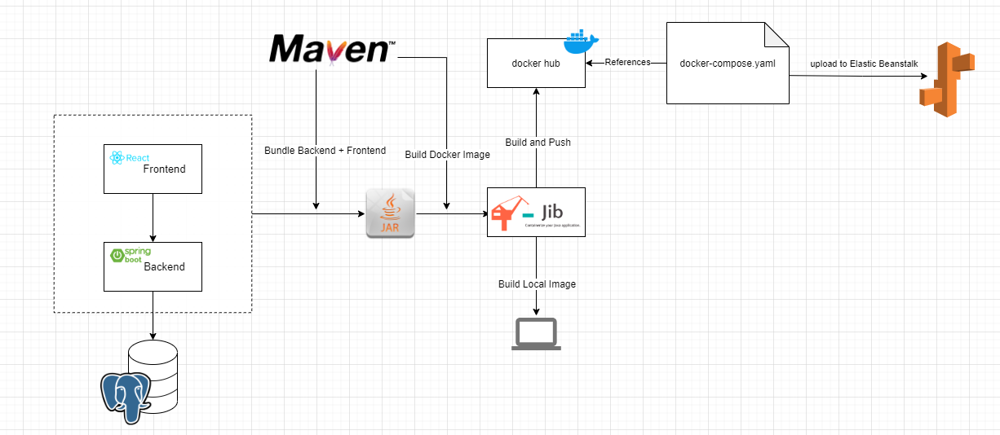
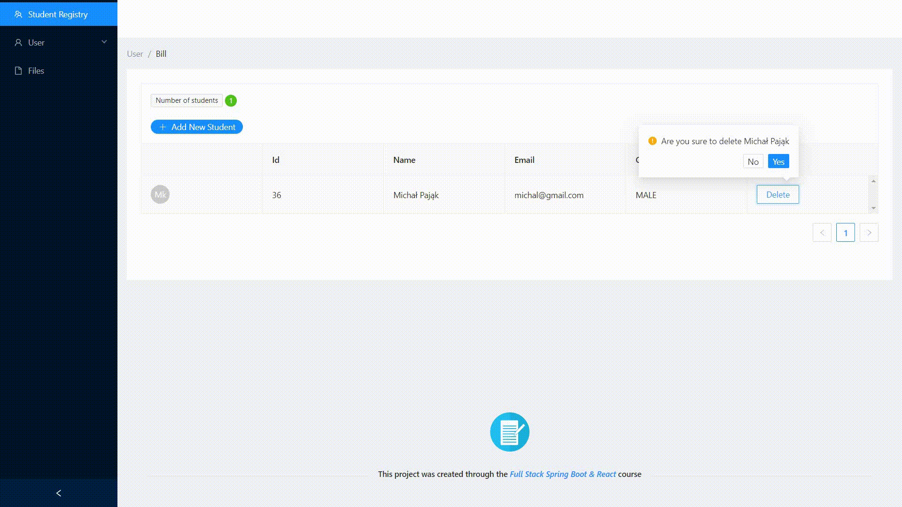

# Student Registry
- This project was created through the `Full Stack Spring Boot & React (PROFESSIONAL)` course, to access it click [here](https://amigoscode.com/p/full-stack-spring-boot-react).

## Index :pushpin:
- [About](#about)
- [Architecture Diagram](#architecture)
- [Show me the result](#result)
- [Software testing](#software-testing)

## About  :bulb:
The course provided me with essential the knowledge about building a full stack application from the ground up. 

This project helped me understand and put the following concepts into practice:

- <strong>Spring Boot</strong> Backend API
- Frontend with <strong>React.js Hooks and Functions Components</strong>
- <strong>Maven</strong> 
- Databases using <strong>Postgres on Docker</strong>
- <strong>Spring Data JPA</strong>
- Server and Client Side Error Handling
- Packaging applications for <strong>deployment using Docker and Jib</strong>
- <strong>AWS RDS & Elastic Beanstalk</strong>
- Software Deployment Automation with <strong>Github Actions</strong>
- Software Deployment Monitoring with <strong>Slack</strong>
- <strong>Unit and Integration Testing</strong>

## Architecture Diagram  :pencil2:

## :link: Show me the result 

## Software testing  :man_technologist:
Tools and libraries used for testing (carried out on a branch: testing):

- Unit Testing (<strong>JUnit5 & AssertJ</strong>)
- Testing External Services
- Mocking with <strong>Mockito</strong>
- Integration Testing

